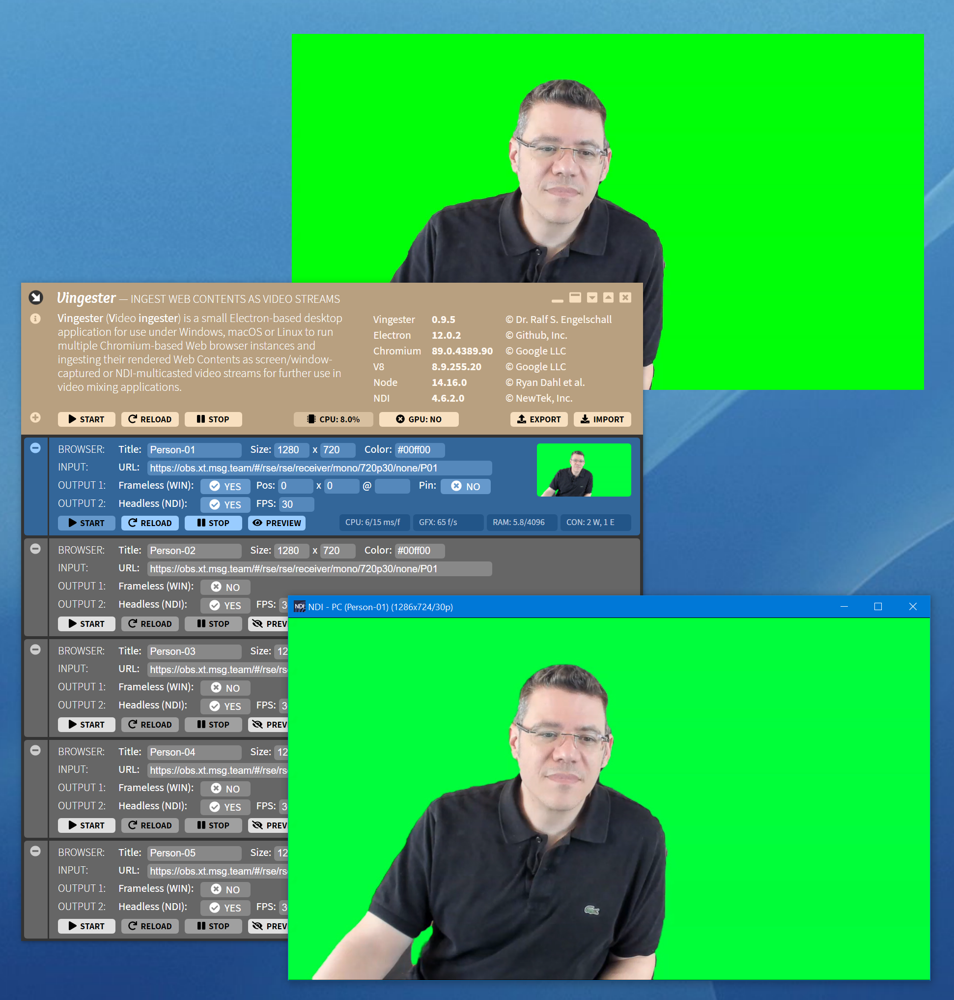

Vingester
=========

**Ingest Web Contents as Video Streams**

About
-----

**Vingester** (**V**ideo **ingester**) is a small [Electron](https://www.electronjs.org/)-based
desktop application for use under Windows, macOS and Linux to
run multiple [Chromium](https://www.chromium.org/)-based Web
browser instances and ingesting their rendered Web Contents as
desktop/window-captured or [NDI](https://www.ndi.tv/)-multicasted video
streams for further use in video mixing applications.

Motivation
----------

Although not strictly tied to this use case, **Vingester** was born for
and is primarily intended as an essential companion application to [OBS
Studio](https://obsproject.com/) and [OBS.Ninja](https://obs.ninja/)
in order to ingest the video streams of OBS.Ninja meeting particpants
into an OBS Studio based production in an efficient and robust way.

The challenge here is that although OBS.Ninja could be directly running
in a [Browser Source](https://github.com/obsproject/obs-browser) of
OBS Studio, using it for more than 2-3 participants usually causes a
dramatical performance drop-down in OBS Studio and as a side-effect
at least regularily destroys the entire audio quality in OBS Studio.
By externally ingesting the video streams of meeting participants
through **Vingester**, this performance degradation in OBS Studio can be
avoided, although the total system load will be not necessarily lower.

Performance Notice
------------------

Performance in ingesting of Web Content is crucial. The following
related aspects should be kept in mind:

- *GPU Hardware Acceleration*: 
  Both **Vingester** and OBS Studio use Chromium for the browser
  component in order to render Web Content. Chromium has the possibility
  to leverage from GPU Hardware Acceleration to speed up video decoding
  and similar tasks. When rendering the Web Content into a desktop
  window, GPU Hardware Acceleration should be *enabled*. But when
  rendering the Web Content off-screen GPU Hardware Acceleration should
  be *disabled*, as for off-screen rendering the use of the GPU slows
  down at least the capturing process. Use the "GPU" toggle at the
  top right corner of **Vingester** to enable/disable GPU Hardware
  Acceleration.

- *Frameless/Headless Rendering*: 
  **Vingester** supports both "frameless" (desktop-window based)
  and "headless" (NDI network protocol based) modes of operation. The
  "frameless" mode means that **Vingester** lets Chromium render the Web
  Content into a frameless desktop window which then should be captured
  by OBS Studio. The "headless" mode means that **Vingester** lets
  Chromium render the Web Content off-screen, internally captures the
  contents and sends the results as a video stream via Network Display
  Interface (NDI) protocol to the local network. The "frameless" mode is
  best combined with GPU Hardware Acceleration enabled. The "headless"
  mode is best combined with GPU Hardware Acceleration disabled. Also
  keep in mind that although **Vingester** supports both "frameless" and
  "headless" mode in parallel, using this combined mode means that the
  (usually lower) NDI framerate has to be simulated by skipping frames
  of the (usually higher) desktop framerate. As a result, this combined
  mode can result is less stable NDI streams.

- *Content Previewing*: 
  **Vingester** supports previewing the rendered Web Content in a small
  thumbnail image of the main window. This is not very useful for the
  "frameless" mode of operation in practice, but can be important for
  debugging in case of "headless" mode. Nevertheless, use the previewing
  only for debugging purposes as it also throttles the performance of
  **Vingester**.

- *Desktop/Window Capturing*: 
  OBS Studio can capture both an entire desktop and just a particular
  window. Capturing an entire desktop is more efficient as it leverages
  from GPU Hardware Acceleration within the operating system, but
  requires a large or even spare monitor for displaying the browser
  window(s) of **Vingester**. Capturing just a particular window is less
  efficient as it cannot leverage GPU Hardware Acceleration within the
  operating system, but does not require a large or even spare monitor
  (all browser windows even can overlap).

These points together means you should use one of the following
modes of operation in practice only:

- Vingester: **enabled GPU Hardware Acceleration** + **Frameless Mode** 
  OBS Studio: **Desktop Capturing Source** + **Cropping Transform** 
  In this mode you enable GPU Hardware Acceleration within **Vingester**
  and render the Web Content into dedicated "frameless" desktop
  windows which then are all together "desktop captured" by OBS Studio
  and just split into individual videos within OBS Studio through
  multiple cropping transforms. This combination usually has the best
  overall performance as GPU Hardware Acceleration is used both within
  **Vingester** and the operating system for OBS Studio.

- Vingester: **disabled GPU Hardware Acceleration** + **Headless Mode** 
  OBS Studio: **NDI Source** 
  In this mode you disable GPU Hardware Acceleration within
  **Vingester** and render all the Web Content off-screen in "headless"
  mode, let them be sent out as NDI video streams and directly used
  within OBS Studio through its NDI Source. This combination is the most
  elegant way, but as GPU Hardware Acceleration cannot be used it has
  less performance than the previous mode of operation.

Copyright & License
-------------------

Vingester 
Copyright &copy; 2021 [Dr. Ralf S. Engelschall](mailto:rse@engelschall.com) 
Licensed under [GPL 3.0](https://spdx.org/licenses/GPL-3.0-only)

