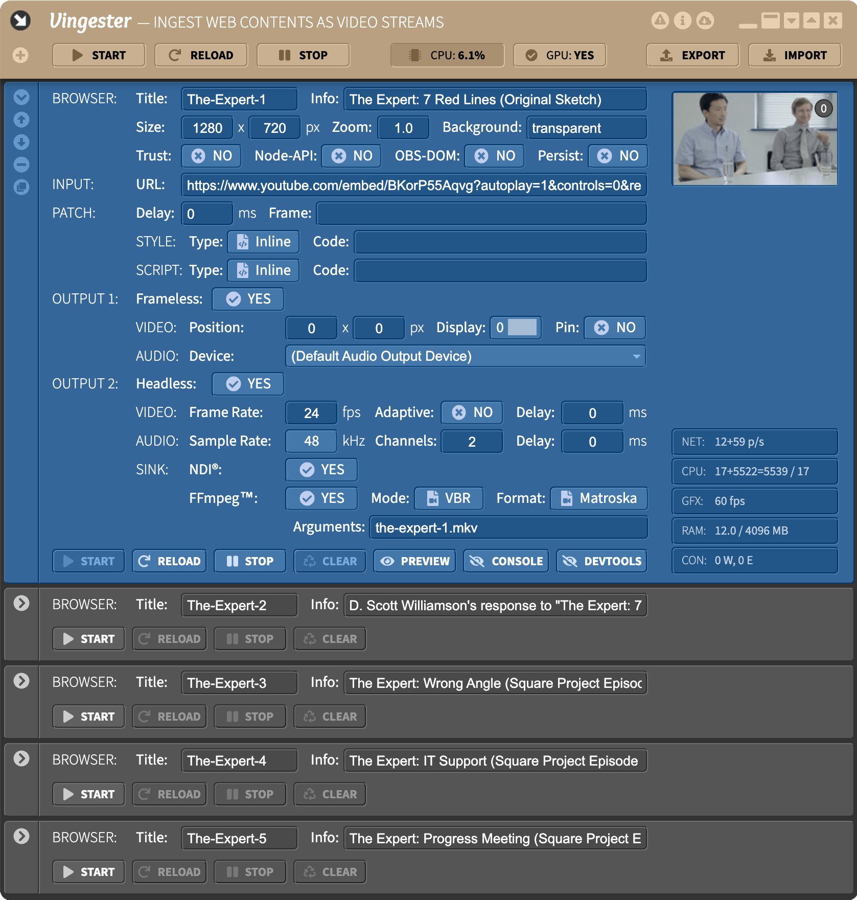

About
=====

Overview
--------

**Vingester** (**V**ideo **ingester**) is a small
[Electron](https://www.electronjs.org/)-based desktop
application for use under Windows, macOS or Linux, to run
multiple [Chromium](https://www.chromium.org/)-based Web
browser instances and ingesting their rendered Web Contents as
screen/window-captured or [NDI&reg;](https://www.ndi.tv/)-multicasted or
[FFmpeg&trade;](https://ffmpeg.org)-based video streams for further use
in local or remote video mixing applications or for local recording.



Motivation
----------

Although not tied to this particular use case, **Vingester** was
originally born for and is primarily intended as an essential
companion application to [OBS Studio](https://obsproject.com/) and
[VDO.Ninja](https://vdo.ninja/) (formerly OBS.Ninja), in order to ingest the video streams of
[VDO.Ninja](https://vdo.ninja/) meeting participants into an OBS Studio
based video production in an efficient and robust way.

The challenge here is that although [VDO.Ninja](https://vdo.ninja/)
could be directly running in a [Browser
Source](https://github.com/obsproject/obs-browser) of [OBS
Studio](https://obsproject.com/), using this approach for more than 2-3
participants usually causes a dramatical performance drop-down in [OBS
Studio](https://obsproject.com/) and as a side-effect at least regularly
and noticably destroys the audio quality. 

```nomnoml
#direction: right
#fill: #ffffff; #f0f0f0; #e0e0e0
#stroke: #333333
#font: Source Sans Pro
#fontSize: 12
#lineWidth: 1
#spacing: 80
#padding: 0
#edges: rounded

[<frame> Original Workflow|
    [<frame> Chrome|
        [VDO.Ninja (sender)]
    ]--WebRTC[<frame> OBS Studio|
        [OBS NDI (source)]
    ]
]
```

By externally ingesting the
video streams of meeting participants through **Vingester**, this
performance degradation in [OBS Studio](https://obsproject.com/) can be
avoided, although the total system load will be not necessarily lower.

Additionally, the **Vingester** approach also better handles packet
losses than [OBS Studio](https://obsproject.com/) (such as guests
on poor WiFi connections) and the Window Capture source of [OBS
Studio](https://obsproject.com/) causes lower resource usage than its
Browser Source. Additionally, **Vingester** does not throttle its
browser performance if it is backgrounded like a regular Chrome browser
does. And **Vingester** windows can be pinned to be always on top of
others windows and determine the correct window sizes if the display
uses a high DPI mode.

As **Vingester** supports [NDI&reg;](https://www.ndi.tv/)-based
multicasting of the output video streams, this open up completely
new possibilities, including using arbitrary mixing applications and
even running them on different computers on the same LAN. Finally, as
**Vingester** also supports [FFmpeg&trade;](https://ffmpeg.org) as the
output sink, it can both locally record the video streams and send them
to remote locations via WAN through streaming protocols like RTMP.

```nomnoml
#direction: right
#fill: #ffffff; #f0f0f0; #e0e0e0; #d0d0d0
#stroke: #333333
#font: Source Sans Pro
#fontSize: 12
#lineWidth: 1
#spacing: 80
#padding: 0
#edges: rounded

[<frame> Optimized Workflow|
    [<frame> Chrome|
        [VDO.Ninja (sender)]
    ]--WebRTC[<frame> Vingester|
        [<frame> Chromium|
            [VDO.Ninja (receiver)]
        ]
    ]
    [Vingester]--NDI[<frame> OBS Studio|
        [OBS NDI (source)]
    ]
]
```

