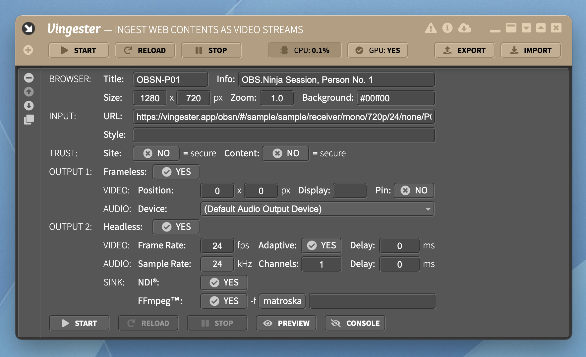

Configuration
=============

Each browser configuration tile in the **Vingester** user interface contains the following
configuration fields.

Browser
-------

The first group of configuration fields target the browser:

- **Browser / Title**: 
  The title of the browser. For "Frameless" operation, this sets the
  title of the desktop window. For "Headless" operation, this sets
  the name of the NDI&reg; stream. Use a short unique identifier.
  An example is `OBSN-P01` (for "OBS.Ninja Person 01").

- **Browser / Info**: 
  The optional information attached to the browser configuration.
  **Vingester** internally does *not* use this information at all.
  It is just for documentation purposes of the user.
  An example is `OBS.Ninja Session, Person No. 1`.

- **Browser / Size**: 
  The width and height in pixels of the browser desktop window (in
  "Frameless" mode) or the off-screen framebuffer (in "Headless" mode).
  Set this to match the video-stream output size. So, if you want to
  stream 720p, use a size of `1280` x `720` pixels. If you want to stream
  1080p, use a size of `1920` x `1080` pixels.

- **Browser / Zoom**: 
  The optical zoom level of the browser. By default it should be kept
  as `1.0`, but use for instance `0.75` to shrink the Web Contents
  by 25%.

- **Browser / Background**: 
  The background color of the browser. Use `transparent` for a fully
  transparent background or `#RRGGBB` for a particular RGB background
  color. For a chroma-key style background, use `#00ff00`.

- **Browser / Trust**: 
  Enable or disable the site trust, i.e., whether the SSL/TLS certificate of the
  site (as specified by **Input / URL**) is trusted. Usually, this should be
  disabled to not enforce the trust and rely on valid certificates. Enable
  it only to especially enfore the trust of your *own* self-signed certificates
  when communicating over `localhost`.

- **Browser / Node-API**: 
  Enable or disable the Electron/Node API integration for the Web
  Contents. Usually, this should be disabled to not give the Web
  Contents access to the local system. Enable it only to especially
  grant access for your *own* applications which require elevated
  privileges.

- **Browser / OBS-DOM**: 
  Enable or disable the OBS Studio Browser Source emulation in the
  Document Object Model (DOM) of the Web Contents. Usually, this should
  only be enabled for applications which explicitly check whether they
  are running under the OBS Studio Browser Source. The most prominent
  example is OBS.Ninja, which this way supports tally light information.

- **Browser / Persist**: 
  Enable or disable the Web Contents session persistence. Enable it
  if you want to keep state across stop/start or reload actions.

Input
-----

The second group of configuration fields target the Web Contents itself:

- **Input / URL**: 
  The URL of the Web Contents to render. Typical examples are
  YouTube URLs like `https://www.youtube.com/embed/BKorP55Aqvg?autoplay=1&controls=0&rel=0`,
  OBS.Ninja (Trampoline) URLs like `https://vingester.app/obsn/#/sample/sample/receiver/mono/720p/24/none/P01`, etc.
  Ensure that the Web Contents does not require any interactions and optimally expands to 100% of the
  browser canvas.

- **Input / Style**: 
  The CSS styles to be injected into the Web Contents for overriding its styles.
  For instance, use `html, body { background: transparent !important; }` to
  force the background of the Web Contents to be transparent.

Output 1 (Frameless)
--------------------

- **Output 1 / Frameless**: 
  Enable or disable the "Frameless" mode of operation where the Web
  Contents is running inside an *on-screen* browser instance. The result
  has to be captured externally by, for instance, a Desktop Source
  inside OBS Studio.

- **Output 1 / Video / Position**: 
  The position of the desktop window of the browser instance. If
  **Output 1 / Video / Display** is empty or `0,0` this is the position
  in pixels of the browser window's top-left corner, relative to the
  top-left corner of the primary display.

- **Output 1 / Video / Display**: 
  The selection of the display. If empty or `0,0` the primary display
  is used. Other displays can be selected with `-X,-Y` relative to the
  primary display. For instance, `-1,0` is the display left to the
  primary display, `0,+1` is the display at the top of the primary
  display.

- **Output 1 / Video / Pin**: 
  Enable or disable the pinning of the browser window to the top, i.e.,
  the z-position is higher than other windows. This ensures that no
  other windows overlap it and this way destroy the capturing.

- **Output 1 / Audio / Device**: 
  Set the audio output device. The device usually has to be
  a "virtual output cable" device like [Virtual Audio Cable](https://vac.muzychenko.net/en/)
  or [VB-Cable](https://vb-audio.com/Cable/) under Windows, or
  [Loopback](https://rogueamoeba.com/loopback/) or
  [BlackHole](https://github.com/ExistentialAudio/BlackHole) under macOS.

Output 2 (Headless)
-------------------

- **Headless**: 
  Enable or disable the "Headless" mode of operation where the Web
  Contents is running inside an *off-screen* browser instance. The
  result is captured internally for forther processing through the
  NDI&reg; and FFmpeg&trade; sinks.

- **Headless / Video / Frame Rate**: 
  The Frames Per Second (FPS) for both capturing and sending the Web
  Contents. Use `24` for Cinema, `25` for PAL, `29.97` for NTSC, `30`
  for Standard or even `60` for 2x Standard.

- **Headless / Video / Adaptive**: 
  Enable or disable the NDI-Tally-based FPS adaption, i.e., the FPS
  is reduced to 1 if the NDI stream has no connected receivers and no
  preview is enabled, the FPS is reduced to 5 if the NDI stream has no
  connected receivers and the preview is enabled, and the FPS is reduced
  to 1/3 of the **Headless / Video / Frame Rate** if the NDI stream has
  connected receivers but is still *not* in the preview or program at
  one of those connected receivers.

- **Headless / Video / Delay**: 
  The delay of the video frames in milliseconds. Use this if the audio
  is behind the video and hence the video has to wait for the audio to
  be in sync again. Usually this is not needed, as audio processing
  usually is faster than video processing.

- **Headless / Audio / Sample Rate**: 
  The audio sample rate in kilo-hertz (kHz). Only audio sample rates of
  the underlying OPUS codec are supported. Use `8` for very low audio
  quality, use `12` or `16` for medium audio quality, use `24` for a
  good audio quality, and use `48` for the best audio quality.

- **Headless / Audio / Channels**: 
  The number of audio channels. Use `0` to disable the audio stream at
  all, use `1` for a mono audio stream and use `2` for a stereo audio
  stream. Ensure that this matches your Web Contents.

- **Headless / Audio / Delay**: 
  The delay of the audio frames in milliseconds. Use this if the video
  is behind the audio and hence the audio has to wait for the video to
  be in sync again. This can be needed, as audio processing usually is
  faster than video processing.

- **Headless / Sink / NDI**: 
  Enable or disable the NDI&reg; sink engine. The sent out NDI
  multicast streams use the **Browser / Title** as their name. Use [NDI
  Studio Monitor](https://www.ndi.tv/tools/), [NDI Virtual Input](https://www.ndi.tv/tools/),
  [OBS Studio](https://obsproject.com) + [OBS-NDI](https://github.com/Palakis/obs-ndi/), or
  [LiveMind Receiver](https://livemind.tv/recorder) for receiving the sent NDI streams.

- **Headless / Sink / FFmpeg**: 
  Enable or disable the FFmpeg&trade; sink engine.
  Use the following two options for controlling FFmpeg's particular operation.

- **Headless / Sink / FFmpeg / (Format)**: 
  The command-line interface (CLI) argument of FFmpeg's `-f` option to
  set the output format. You can select between `matroska` (MKV), `mp4`
  (MPEG-4), `mpegts` (MPEG-TS), `flv` (Flash/FLV). Usually, you want to
  use `matroska` for optimized local recording, `mp4` for alternative
  local recording, `mpegts` for UDP-based remote streaming and `flv` for
  RTMP-based remote streaming.

- **Headless / Sink / FFmpeg / (Arguments)**: 
  The command-line interface (CLI) arguments of FFmpeg to be appended to
  override the default options, set additional output options and to set
  the output URL. For local recording use an argument like `example.mkv`.
  For UDP-based streaming use an argument like `udp://10.0.0.1:12345`
  and for RTMP-based streaming use an argument like `rtmp://10.0.0.1:1935/live/example`.

