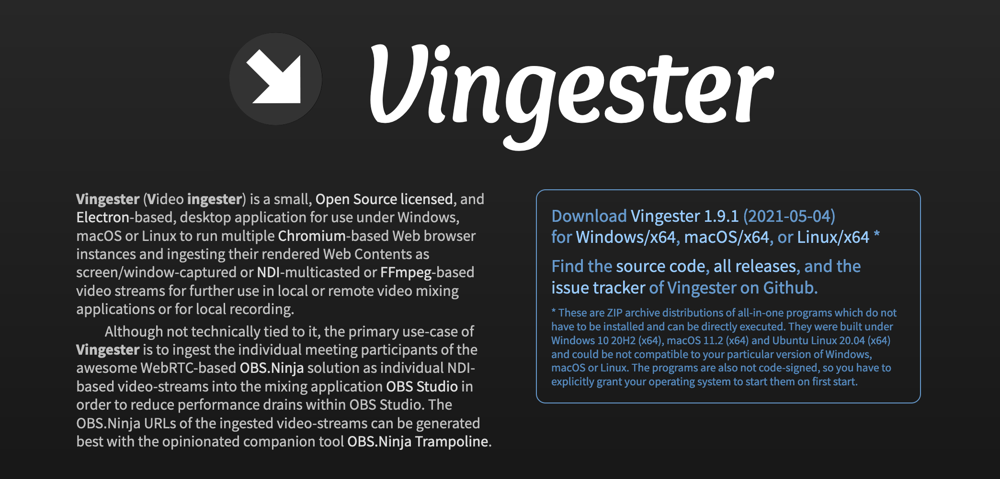
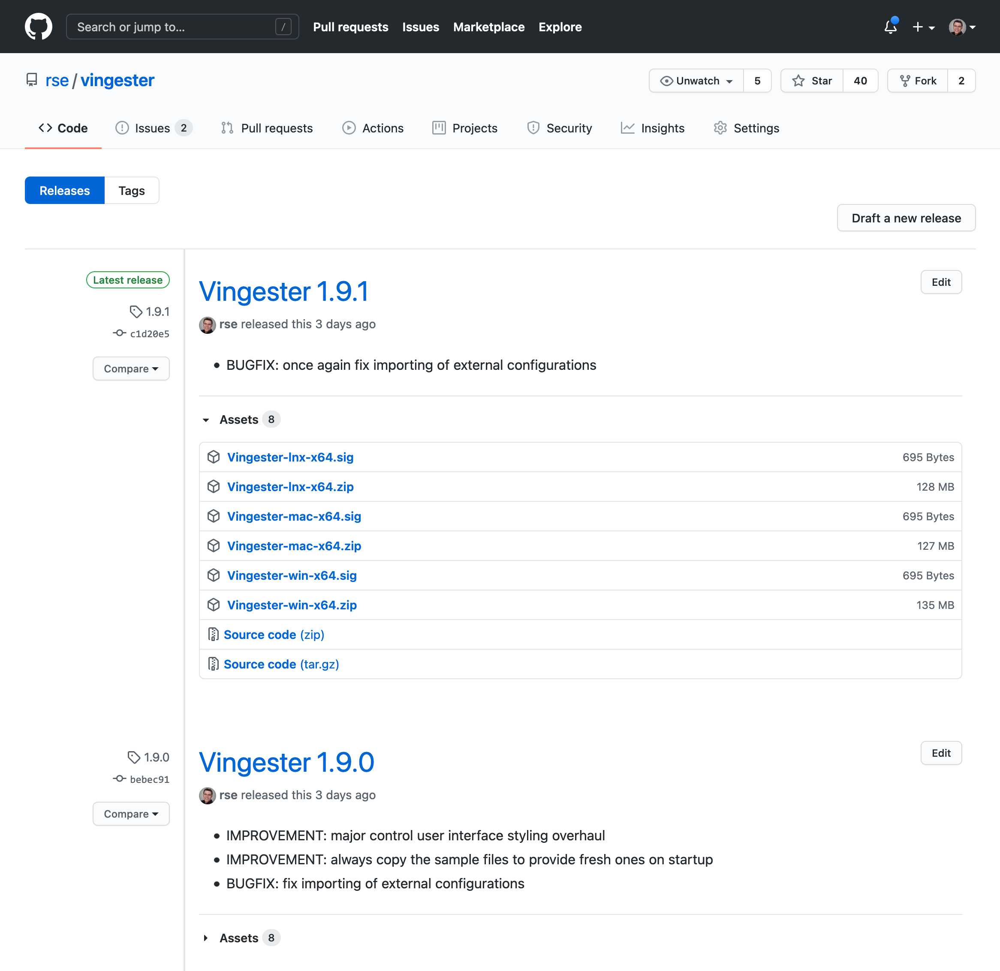

Installation
============

Download
--------

**Vingester** is based on the portable
[Electron](https://www.electronjs.org/) technology and as a consequence
is equally available for both Windows, macOS and Linux operating
systems running under Intel-compatible 64-bit CPUs.

For downloading the latest version of **Vingester** go to the homepage at:

- https://vingester.app/

For downloading an older version of **Vingester**
go to the Github "releases" page at:

- https://github.com/rse/vingester/releases

There, go the particular version are you are interested in, open the
folded "Assets" part and download the ZIP archive corresponding to
your operating system:

- `Vingester-win-x64.zip` for Windows/x64
- `Vingester-mac-x64.zip` for macOS/x64
- `Vingester-lnx-x64.zip` for Linux/x64

Installation
------------

After downloading the ZIP archive, unpack it by double-clicking the
file and using the operating system specific function to extract the
contained executable. Copy the extracted executable to an arbitrary
location where your current user has access to.

> [!NOTE]
> **Vingester** intentionally does NOT come with an "installer".
> Instead, it is packaged as a self-contained single-file executable
> which can be run from an arbitrary filesystem location and with
> just regular user privileges. For updating purposes, instead of an
> installer, **Vingester** contains a built-in update mechanism which
> allows you to in-place update the executable itself in your chosen
> filesystem location.

> [!TIP]
> We recommend you to copy the **Vingester** executable to either
> your desktop or a local application area. Under Windows the
> desktop is `%HOME%\Desktop` and the local application area can be
> `%HOME%\AppData\Local\Vingester\` or `%APPDATA%\Local\Vingester\`.
> Under macOS the desktop is `$HOME/Desktop` and the local application
> area can be `$HOME/Applications/Vingester/`. Under Linux the desktop
> is `$HOME/Desktop`, but there is no standardized local application
> area.

> [!TIP]
> **Vingester** stores its local configuration data in the following
> locations: `%APPDATA%\Roaming\Vingester\` under Windows,
> `$HOME/Library/Application Support/Vingester/` under macOS
> and `$HOME/.config/Vingester` under Linux. If you want to
> wipe the **Vingester** configuration, just remove those
> directories if **Vingester** is not running.

