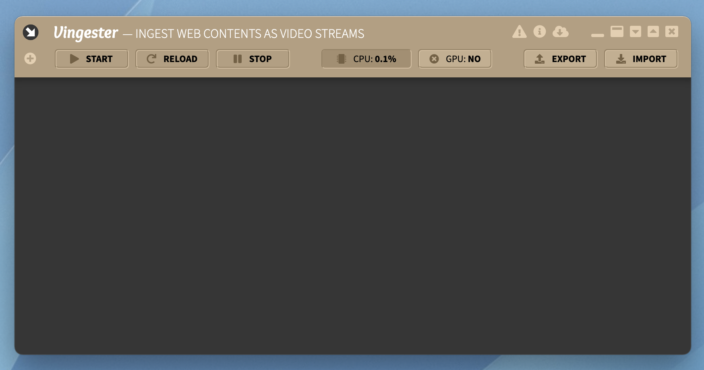
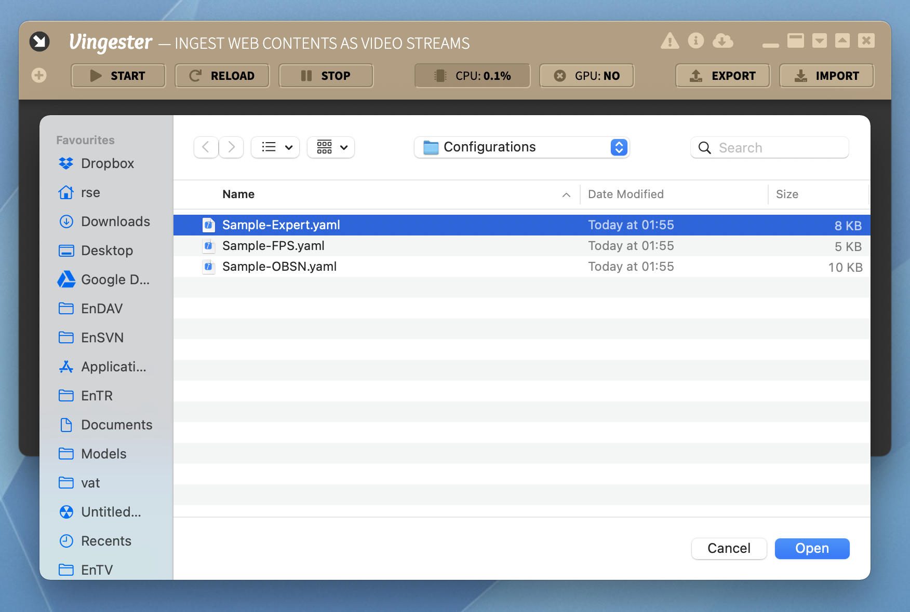
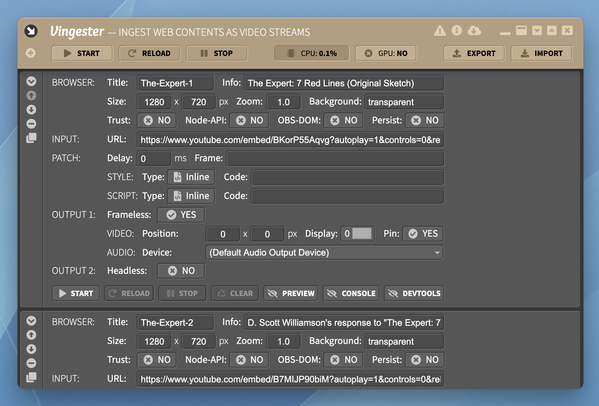
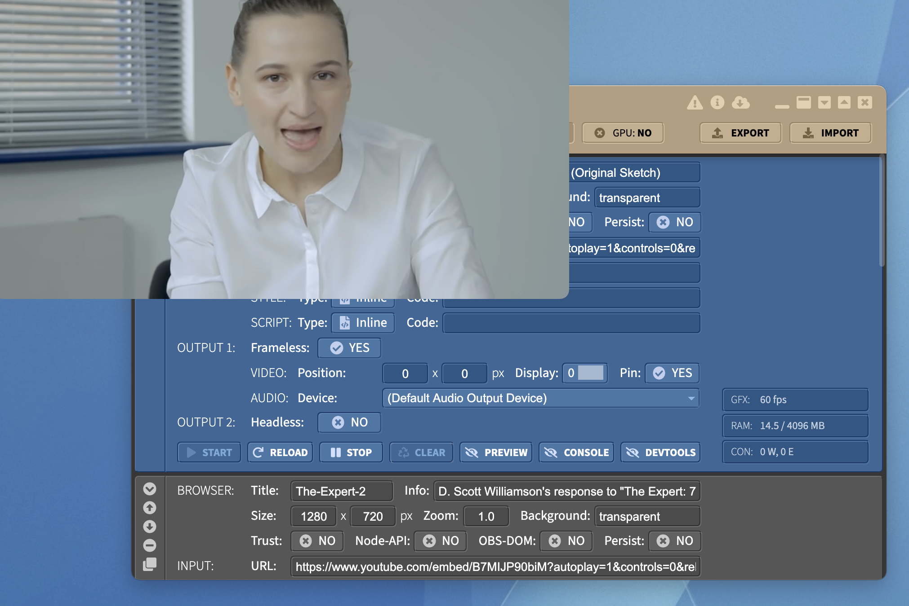
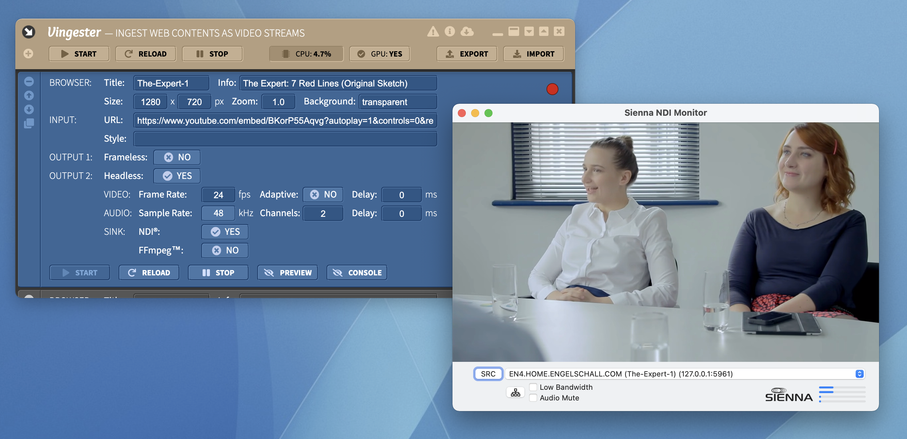

Usage
=====

Basic Usage
-----------

Start **Vingester** by double-clicking its self-contained single-file executable.

> [!ATTENTION]
> The **Vingester** executables are intentionally not signed by the
> author, because this would require two certificates of expensive
> certificate authorities and this is not in balance with the Open
> Source nature of such a freely available product. As a consequence,
> on first start of **Vingester** under at least Windows and macOS,
> you once have to manually approve the application. For this, under
> Windows, in the blue popup dialog, choose "More info" and then "Run
> anyway". Under macOS, go to *System Preferences* &rarr; *Security &
> Privacy* &rarr; *General* and allow the application to open. Under
> Linux there is no need to explicitly allow the application.

Please be patient a few seconds, as **Vingester**'s packaging mechanism needs
some time to unfold its contained virtual filesystem into a temporary filesystem location.
After a few seconds, the **Vingester** configuration user interface can be seen.



Initially, **Vingester** has no browser instances configured at all.
For a quick test-drive, click on *IMPORT* at the top right, select
the file `Sample-Expert.yaml`, click *Open* and then start the
first browser instance with title "The-Expert-1" by clicking
*START*.





Voila! You will see the YouTube video be played back in a "frameless"
desktop window, located on top of all other desktop windows and ready to
be screen- or window-captured.

Operation Modes
---------------

Each browser instance in **Vingester** has two output options. Usually
just one of them is used, but technically they can be used in
parallel, too.

### Frameless

The "Frameless" operation mode runs an on-screen browser instance. The
output of this browser is displayed in a frameless desktop window,
intended to be screen- or window-captured by a video mixing application
like [OBS Studio](https://obsproject.com). 

```nomnoml
#direction: right
#fill: #ffffff; #f0f0f0; #e0e0e0; #d0d0d0
#stroke: #333333
#font: Source Sans Pro
#fontSize: 12
#lineWidth: 1
#spacing: 80
#padding: 10
#edges: rounded

[<frame> Frameless Mode|
    [Vingester]--[<frame> Chromium (onscreen)|
        [<reference> content]
    ]
    [Chromium (onscreen)]--Capture[<frame> OBS Studio|
        [OBS Window Capture (source)]
    ]
]
```

The pros and cons of this operation mode are:

- Pro:
    - supports *full* GPU hardware acceleration
    - provides *higher* Frames Per Second (FPS) rate
    - requires *less* CPU power
- Con:
    - requires *extra* desktop space
    - requires *extra* "virtual audio cable" device
    - requires *local* capturing/mixing application


### Headless

The "Headless" operation mode runs an off-screen browser
instance. The output of this browser is internally captured and
sent out as a [NDI&reg;](https://www.ndi.tv/)-multicasted or
[FFmpeg&trade;](https://ffmpeg.org)-based video stream for further use
in local or remote video mixing applications or for local recording purposes.

```nomnoml
#direction: right
#fill: #ffffff; #f0f0f0; #e0e0e0; #d0d0d0
#stroke: #333333
#font: Source Sans Pro
#fontSize: 12
#lineWidth: 1
#spacing: 80
#padding: 10
#edges: rounded

[<frame> Headless Mode|
    [<frame> Vingester|
        [<frame> Chromium (offscreen)|
            [<reference> content]
        ]
    ]--NDI[<frame> OBS Studio|
        [OBS NDI (source)]
    ]
]
```

The pros and cons of this operation mode are:

- Pro:
    - requires *no* desktop space
    - requires *no* "virtual audio cable" device
    - supports *local and remote* capturing/mixing application
- Con:
    - supports *just partial* GPU hardware acceleration
    - provides *lower* Frames Per Second (FPS) rate
    - requires *more* CPU power



Basic Functions
---------------


The **Vingester** user interface provides global functions (across all browsers)
and local functions (for a particular browser only).

### Global Functions

- **START**: Pressing this global button starts all still not started browsers.
  Use this as a convenience function.

- **RELOAD**: Pressing this global button reloads all started browsers.
  Use this as a convenience function.

- **STOP**: Pressing this global button stops all started browsers again.
  Use this as a convenience function.

- **CPU**: This displays the current CPU utilization caused by **Vingester**.
  Ensure that the overall system CPU utilization does not exceeed about
  80% or you will experience noticable quality drops and delays in both video and
  audio processing.

- **GPU**: Pressing this button toggles the GPU hardware acceleration.
  This toggling requires a full restart of the **Vingester** application.
  Usually you want to *enable* GPU hardware acceleration for *Frameless*
  mode of operation, and disable it for *Headless* mode of operation.

- **EXPORT**: Pressing this button opens a filesystem dialog. Select a
  target directory and target filename like `example.yaml`. All browser
  configurations are then exported to this file.

- **IMPORT**: Pressing this button opens a filesystem dialog. Select a
  source directory and source filename like `example.yaml`. All browser
  configurations are then replaced by the ones imported from this file.
  Three pre-exported standard configurations are shipped with **Vingester**
  for demonstration purposes:

  - `Sample-Expert.yaml`: five configurations containing the *The Expert*
    business comedy videos on YouTube, ready to be ingested in "Frameless"
    mode with all videos side by side.

  - `Sample-FPS.yaml`: three configurations containing some "longboarding"
    documentation videos on YouTube for demonstrating different source
    Frames Per Second (FPS) scenarios.

  - `Sample-OBSN.yaml`: six configurations containing six receiving sides of
    the awesome WebRTC-based online meeting solution *OBS.Ninja*, ready
    to be ingested in "Headless" mode via NDI&reg;.
    The sender sides can be opened via URLs like
    https://vingester.app/obsn/#/sample/sample/sender/mono/720p/24/none/P01/P01

  - `Sample-Test.yaml`: single configuration containing the Vingester Test
    page https://vingester.app/test/ for quick test-driving.

### Local Functions

- **Collapse/Expand**: Collapse/expand the browser configuration entry.

- **Move Up**: Move the browser configuration entry up in the list.

- **Move Down**: Move the browser configuration entry down in the list.

- **Delete**: Delete the browser configuration entry.

- **Clone**: Clone/duplicate the browser configuration entry.

- **START**: Pressing this local button starts the browser.

- **RELOAD**: Pressing this local button reloads the browser and this way its Web Contents.

- **STOP**: Pressing this local button stops the browser.

- **PREVIEW**: Pressing this local button toggles the display of the Web Contents
  preview in the top right corner of the browser configuration tile.

- **CONSOLE**: Pressing this local button toggles the display of the Web Contents
  console at the bottom of the browser configuration tile.

- **DEVTOOLS**: Pressing this local button toggles the display a
  detached DevTools window for low-level interaction with the Web Contents.

